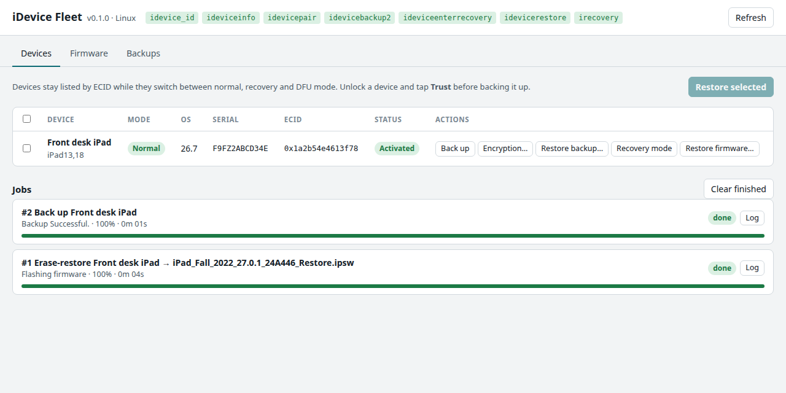

# iDevice Fleet

> **This is the original Python web version.** It restores through `idevicerestore` and needs the libimobiledevice
> command-line tools. The actively developed desktop app, written in Rust, lives on
> [`main`](https://github.com/Maxjr2/idevice-fleet).

A local web UI for restoring, backing up and re-provisioning many iPhones and iPads at once, built on the
[libimobiledevice](https://libimobiledevice.org) tools. No Mac needed.

It was written for MDM migrations: wiping a few dozen company iPads with firmware you downloaded beforehand,
several at a time, and keeping track of each one while it moves between normal, recovery and DFU mode.



## What it does

- **Device list across modes.** Devices are tracked by ECID, so an iPad keeps its name and serial number while it
  reboots into recovery or DFU mode during a restore.
- **Parallel firmware restores** with `idevicerestore`: erase-restore or update, one job per device, up to
  `--max-restores` at the same time (default 4). Each job shows its step and progress, and keeps a full log.
- **Firmware library with preloading.** Look up a model on [ipsw.me](https://ipsw.me), see which versions Apple
  still signs, and download them in advance. Downloads resume after an interruption and are checked against
  their SHA-256 before they're added to the library. You can also drop `.ipsw` files into the library folder.
- **Backups** with `idevicebackup2`: full backups, turning backup encryption on or off, and restoring a backup to
  the same device or to a replacement.
- **Recovery mode**: enter it from normal mode, or kick a device out of a recovery loop.
- **Pairing**: trust the computer from the UI before backing up.

Nothing leaves your machine except the ipsw.me catalog lookup, firmware downloads from Apple's CDN, and the
signing request `idevicerestore` itself sends to Apple during a restore.

## Requirements

- Python 3.9 or newer. No other Python packages needed.
- The libimobiledevice command-line tools: `idevice_id`, `ideviceinfo`, `idevicepair`, `idevicebackup2`,
  `ideviceenterrecovery`, `idevicerestore` and `irecovery`. The UI shows which ones it found.
- Internet access during restores: Apple has to sign every restore, so firmware Apple no longer signs can't be
  installed.
- Disk space: one iPad firmware file is 7–10 GB, and each running restore uses its own temporary cache folder.

### Linux (Debian / Ubuntu)

```bash
sudo apt install libimobiledevice-utils idevicerestore usbmuxd
```

If you built libimobiledevice from source with `--prefix=/opt/local`, the tools in `/opt/local/bin` are found
automatically.

### Windows

Run it **natively on Windows, not in WSL** (see below).

1. Install Apple's **Apple Devices** app (or iTunes) from the Microsoft Store. It provides the USB drivers and the
   Apple Mobile Device Service the tools need.
2. Install [MSYS2](https://www.msys2.org), open the *UCRT64* shell and install the tools:
   ```bash
   pacman -S mingw-w64-ucrt-x86_64-libimobiledevice mingw-w64-ucrt-x86_64-idevicerestore
   ```
3. Start iDevice Fleet with `--tools-dir C:\msys64\ucrt64\bin`.

On Windows, devices that are already in recovery or DFU mode are detected one at a time through `irecovery`.
Devices you connect in normal mode first are remembered by ECID, so restoring them works as usual.

### Why not WSL?

WSL2 has no direct USB access, so iOS devices have to be forwarded with
[usbipd-win](https://github.com/dorssel/usbipd-win). Backups and device info can work that way, but restores
don't work reliably: the device disconnects and reconnects with a new USB ID every time it changes mode, and
large firmware transfers fail
([usbipd-win#959](https://github.com/dorssel/usbipd-win/issues/959)).

## Run it

```bash
git clone https://github.com/Maxjr2/idevice-fleet
cd idevice-fleet
python3 -m idevice_fleet
```

It opens `http://127.0.0.1:8765` in your browser. Options:

| Option | Default | |
|---|---|---|
| `--data DIR` | `~/idevice-fleet` | Firmware library, backups, logs and restore cache |
| `--port N` | `8765` | Local port |
| `--tools-dir DIR` | | Folder with the libimobiledevice tools, if they aren't on PATH |
| `--max-restores N` | `4` | Restores that run at the same time |
| `--no-browser` | | Don't open a browser |

The server only listens on `127.0.0.1`. It rejects requests that don't name localhost as their host, and write
requests have to carry a custom header, so other websites can't drive it from your browser.

## A restore, step by step

1. **Firmware tab:** look up the model identifier (for example `iPad13,18`; the devices you connect are
   suggested) and download the signed version.
2. **Devices tab:** connect the devices. Select them and choose **Restore selected**. The newest matching
   firmware is preselected for each device.
3. Choose **Erase** (full restore) or **Update** (keeps data), type the confirmation word and start.
4. Watch progress in **Jobs**. If a job fails, open its log. The full `idevicerestore` log is also saved in the
   `logs` folder.

Activation Lock is still enforced after an erase. Turn off Find My first, or have your MDM's bypass code ready.

## Development

```bash
python3 -m unittest discover -s tests
```

The tests cover the output parsers, the firmware library and the backup reader, and need no device.

## License

MIT. libimobiledevice, idevicerestore and libirecovery are separate projects with their own licenses. iDevice
Fleet only runs their command-line tools.
