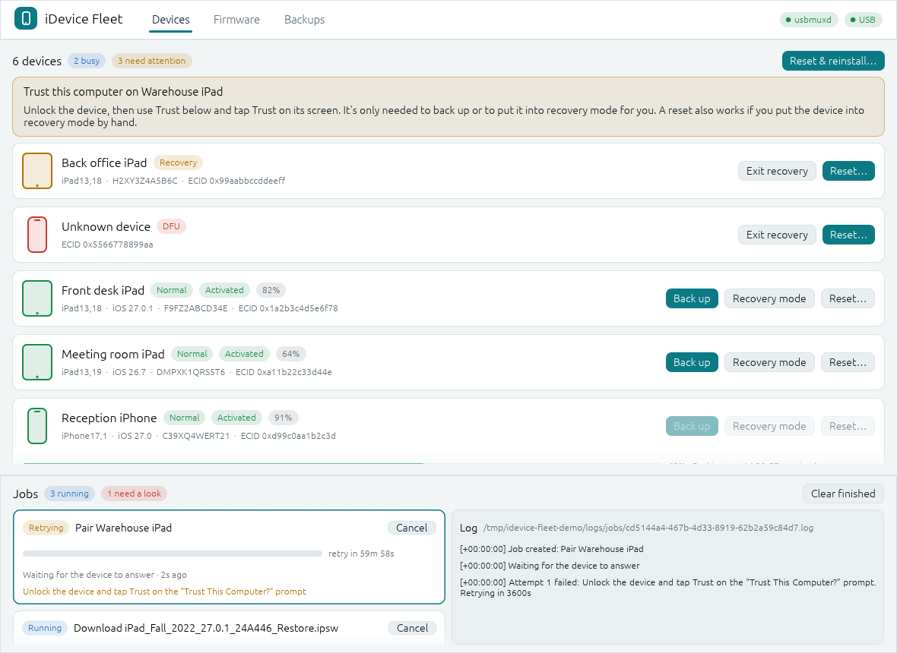
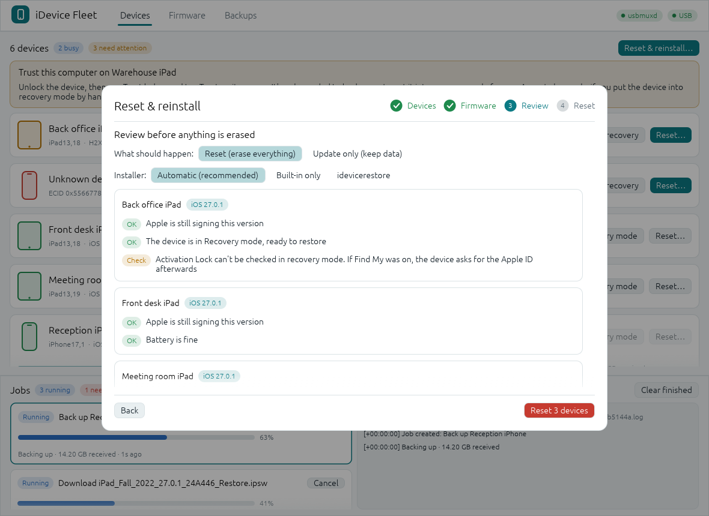
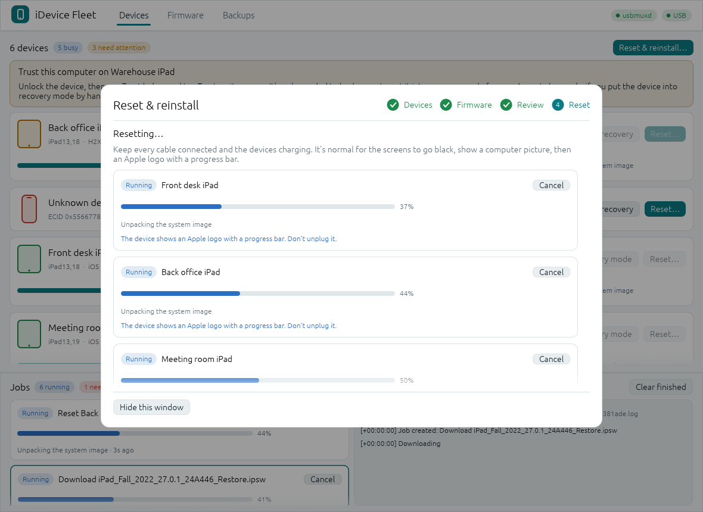
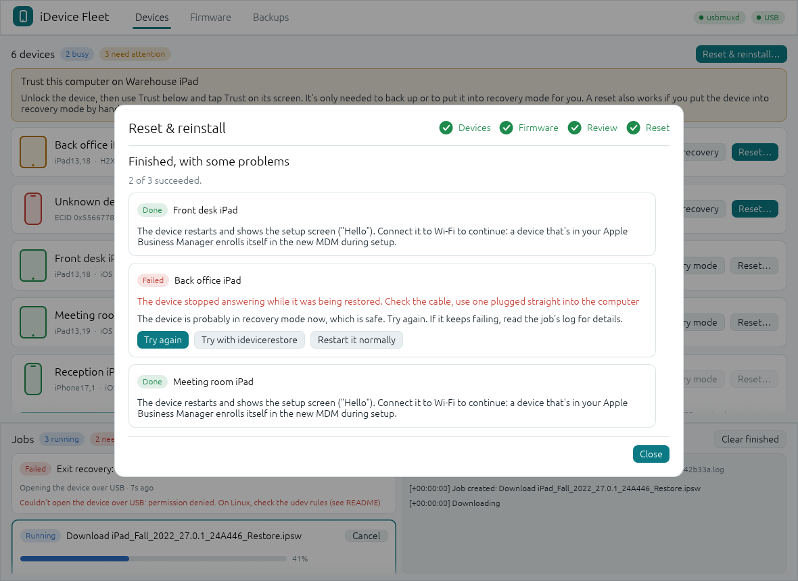
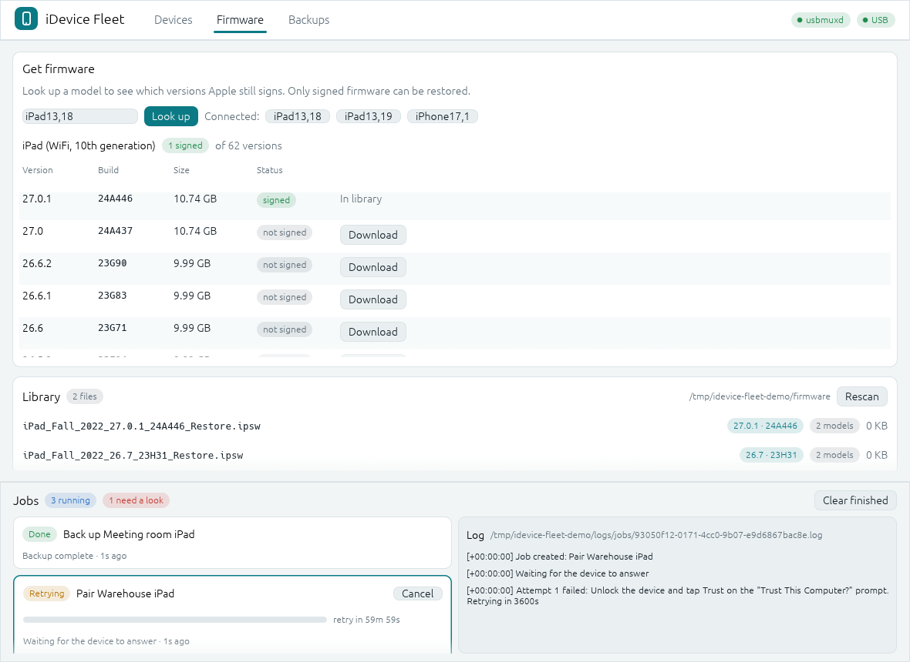
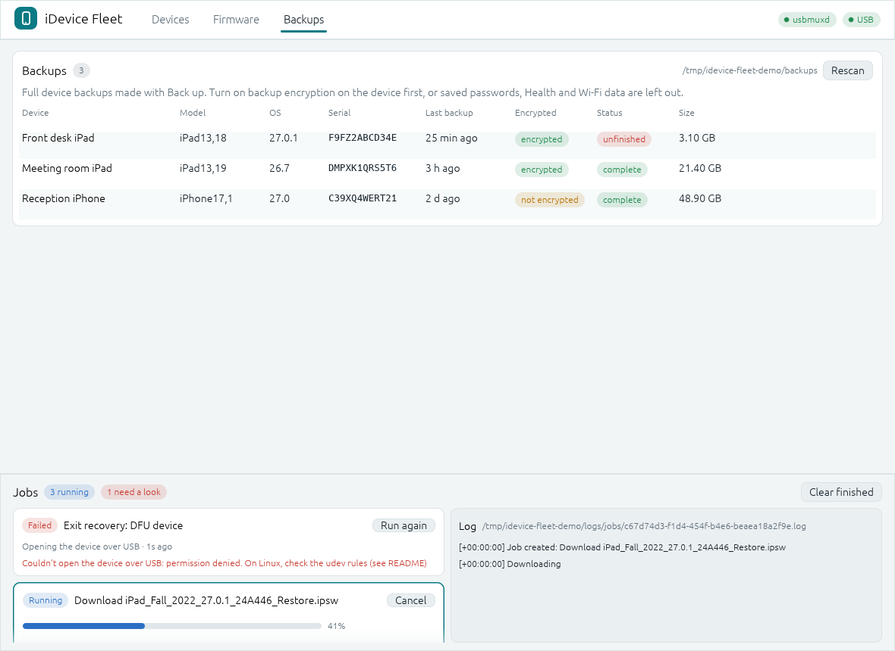

# iDevice Fleet

A desktop app for resetting, backing up and re-provisioning many iPhones and iPads at once. No Mac needed.
Written in Rust on top of the pure-Rust [`idevice`](https://github.com/jkcoxson/idevice) crate, with an
[egui](https://github.com/emilk/egui) interface.

It was written for MDM migrations: wiping a few dozen company iPads with firmware you downloaded beforehand,
several at a time, and keeping track of each one while it moves between normal, recovery and DFU mode.



> **Status: Linux first, and the restore has not been tried on real hardware yet.** Everything is tested with
> simulated devices and a stand-in for `idevicerestore`, but the first run on a real iPad is the real test. If
> something fails, the job log says exactly what happened, and **Try with idevicerestore** is one click away.
> The previous web version, which restores through `idevicerestore`, is on the
> [`python-web`](https://github.com/Maxjr2/idevice-fleet/tree/python-web) branch.

## Install

Download the `.deb` from the [latest release](https://github.com/Maxjr2/idevice-fleet/releases/latest) and install it:

```bash
sudo apt install ./idevice-fleet_0.2.0_amd64.deb
```

This pulls in `usbmuxd`, installs the udev rule for recovery and DFU mode, and adds iDevice Fleet to your
application menu. `idevicerestore` is recommended, not required.

**Updates come the same way.** On startup the app checks the latest release on GitHub. When there is a newer
one, a banner shows what changed, with **Download update**, which fetches the `.deb` and checks it against the
release's `SHA256SUMS`, and then **Install update**, which installs it through the usual system password prompt.
Your settings, backups and firmware library are kept. You can also just `sudo apt install` the new `.deb`
yourself. Turn the check off with `--no-update-check`; it is the only thing the app asks GitHub for.

Built from source instead? See [Build from source](#build-from-source).

## What it does

### A guided reset and reinstall

**Reset & reinstall** walks through the whole thing, and says in plain words what is happening and what, if
anything, you need to do:

1. **Devices.** Pick the devices. A device that isn't listed? The window shows the exact button sequence for
   putting your model into recovery mode by hand.
2. **Firmware.** The newest version Apple still signs is preselected for each device. No firmware for that model
   yet? One click finds and downloads it, and the window waits for it.
3. **Review.** Plain-language checks for each device: is the firmware signed, is it for this model, is there
   disk space, is the battery high enough, is Find My on (Activation Lock). Anything that would make the reset
   fail is marked **Fix this** and blocks the start. You confirm by typing `ERASE`.
4. **Reset.** Live progress per device, with a calm explanation of what the screen is doing ("it's normal for
   it to go black, then show a computer picture"). Every device has its own Cancel.
5. **Result.** What happened to each device, what to do next, and buttons for **Try again**,
   **Try with idevicerestore**, and **Restart it normally** for a device left in recovery mode.



Two installers do the work. The **built-in** one is the pure-Rust restore in the `idevice` crate. **idevicerestore**
is the well-tested C tool, run and supervised as a child process. *Automatic* (the default) uses the built-in one
and switches to `idevicerestore` for cases it can't handle, such as firmware with an encrypted system image.
A restore can also do an **update** that keeps the data instead of a reset.





### Everything else

- **Device list across modes.** Devices are tracked by ECID, so an iPad keeps its name and serial number while it
  reboots into recovery or DFU mode. The window tells you what to do next ("Trust this computer on Front desk
  iPad", "Get firmware for iPad13,18").
- **Pairing and recovery mode.** Trust the computer from the app, put a device into recovery mode, or kick it out
  of a recovery loop.
- **Firmware library with preloading.** Look up a model on [ipsw.me](https://ipsw.me), see which versions Apple
  still signs, and download them in advance. Downloads resume when Apple's servers drop the connection (they
  often do) and are checked against their SHA-256 before they enter the library. You can also drop `.ipsw` files
  into the library folder.
- **Backups.** Full backups with `mobilebackup2`, with a check that your disk has room first, live progress, and a
  list of every backup showing whether it is encrypted and finished.
- **Jobs with live logs.** Everything the app does is a job with its own progress bar, Cancel button and log file.
- **Storage.** See what uses disk space and delete the cache (unfinished downloads and leftover restore files)
  with one confirmed click. Firmware and backups are never touched. A restore also removes its own working files
  when it ends, whether it succeeded, failed or was cancelled.



| | Status |
|---|---|
| Device list across normal / recovery / DFU mode | ✅ |
| Pair (trust), enter recovery, exit recovery | ✅ |
| Guided reset and reinstall, with pre-flight checks | ✅ (not yet run on real devices) |
| Firmware library: signed-version lookup, resumable verified downloads | ✅ |
| Backups: full backup, disk-space check, backup list | ✅ |
| Job engine: retries, watchdog, crash recovery, logs | ✅ |
| `.deb` package and update notices | ✅ |
| Backup encryption on/off, restoring a backup to a device | planned |
| Windows | planned |

Nothing leaves your machine except the ipsw.me lookup, firmware downloads and the signing request to Apple that
every restore needs, and the update check on GitHub.

## Built to keep going

Restoring a few dozen devices takes hours, so the app is built to survive things going wrong:

- **Every device operation is a job** that runs in its own task. If one device's job hits a bug, that job
  fails and everything else keeps running. Even a bug in the window code shows a recovery screen instead of
  closing the app.
- **Retries that make sense.** Failures are sorted into *temporary* (USB hiccup, device rebooting, usbmuxd
  restarting, Apple's servers unreachable), *needs you* (unlock the device, tap Trust), *permanent* and
  *cancelled*. Only temporary failures are retried, with growing delays between attempts. A job that keeps making
  progress between failures, like a big download, isn't cut off after a fixed number of tries.
- **Watchdog.** An attempt that reports no progress for too long is cancelled and retried, so a hung transfer
  doesn't sit there forever.
- **Cancel always works.** A job stops at once, in any state, and shows *Cancelling* while it winds down. A
  cancelled restore leaves the device in recovery mode, which is safe, and the cancelled job can be run again.
- **Survives crashes and restarts.** Jobs are saved in SQLite (WAL mode). After a crash or reboot, a job that
  was running shows up as *Interrupted* with a **Run again** button. Every job writes its own log file as it goes.
- **One job per device** and a limit on parallel restores. Only one copy of the app can use a data folder.
- **Devices don't vanish mid-job.** A device rebooting between stages stays listed as *Reconnecting*, keeping its
  name and serial.
- **Self-healing device watchers.** The usbmuxd connection reconnects when usbmuxd restarts. Recovery and DFU
  devices are found by reading USB descriptors only, which never interferes with a running restore.



## Requirements

- **Linux** (Debian/Ubuntu tested) with `usbmuxd`, which starts when a device is plugged in.
- Internet access for firmware lookup and downloads, and for restores: Apple has to sign every restore, so
  firmware Apple no longer signs can't be installed.
- Disk space: one iPad firmware file is 7–10 GB, a restore unpacks about as much again while it runs, and a backup
  needs about as much room as the device uses. Use `--data` to put it all on an external drive.

### Windows

Not built yet. It will need Apple's **Apple Devices** app (or iTunes) from the Microsoft Store, which provides the
USB drivers and the Apple Mobile Device Service. Run it natively on Windows, not in WSL (see below).

### Why not WSL?

WSL2 has no direct USB access, so iOS devices have to be forwarded with
[usbipd-win](https://github.com/dorssel/usbipd-win). Backups and device info can work that way, but restores
don't work reliably: the device disconnects and reconnects with a new USB ID every time it changes mode, and
large firmware transfers fail
([usbipd-win#959](https://github.com/dorssel/usbipd-win/issues/959)).

## Options

```bash
idevice-fleet [OPTIONS]
```

| Option | Default | |
|---|---|---|
| `--data DIR` | `~/.local/share/idevice-fleet` | Database, logs, firmware library and backups. Also settable with `IDEVICE_FLEET_DATA`. |
| `--demo` | | Show invented devices and jobs and don't touch USB. Handy for trying the interface. |
| `--theme light\|dark` | system | Override the system theme |
| `--no-update-check` | | Don't look for new releases at startup |
| `--screenshot FILE` | | Save a screenshot and quit (this is how the images here were made) |
| `--version` | | Print the version |

## Build from source

You need Rust 1.88 or newer and `usbmuxd`.

```bash
sudo apt install usbmuxd build-essential
git clone https://github.com/Maxjr2/idevice-fleet
cd idevice-fleet
cargo run --release -p fleet-app
```

To use recovery and DFU mode without root when not installing the `.deb`:

```bash
sudo cp packaging/linux/70-idevice-fleet.rules /etc/udev/rules.d/ && sudo udevadm control --reload
```

Build the package yourself with `packaging/deb/build.sh`. It writes the `.deb` and a `SHA256SUMS` file to `dist/`.

## Development

```bash
cargo test -p fleet-core                 # no device needed
cargo test -p fleet-core -- --ignored    # also hits the real ipsw.me and GitHub
cargo run -p fleet-app -- --demo         # try the interface with invented data
```

- `crates/fleet-core`: everything except the window: job engine, persistence, device registry, firmware, backups,
  restore engines and updates.
- `crates/fleet-app`: the egui desktop app, including the guided reset.

The tests cover retries, the watchdog, cancelling in every state, crash recovery, concurrency limits, resumable
downloads against a server that drops every connection, both restore engines (with a stand-in for
`idevicerestore`), the pre-flight checks, cache cleanup, and the update download and install path.

## License

MIT. The recovery-mode USB transport and the native restore flow follow the examples in the
[idevice](https://github.com/jkcoxson/idevice) project (also MIT).
